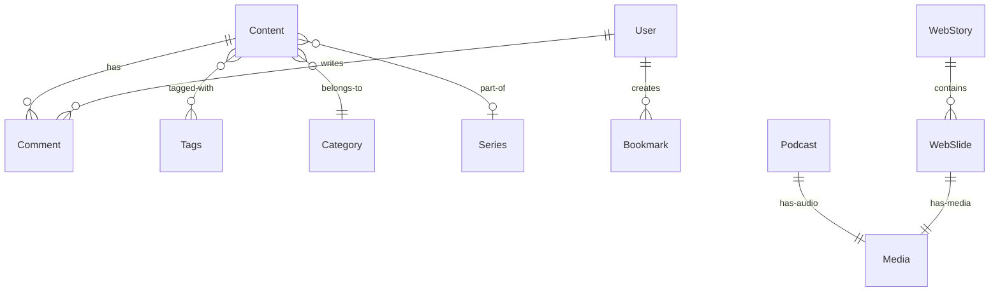

<div align="center">

# 📝 Blog API - Spring Boot REST

</div>

<div align="center">


_A modern, scalable REST API for a personal blog platform built with Spring Boot_

[Getting Started](#-getting-started) •
[Features](#-features) •
[API Documentation](#-api-endpoints) •
[Contributing](#-contributing) •
[License](#-license)

</div>

---

## 🚀 Overview

Blog API is a robust and feature-rich REST API built with **Spring Boot 3.5.8** and **Java 17**. It provides a complete backend solution for a modern blog platform with support for articles, podcasts, web stories, user management, and more.

### ✨ Key Highlights

- 🏗️ **Modern Architecture**: Built with Spring Boot 3.5+ and Java 17
- 🗄️ **Database Driven**: MySQL integration with JPA/Hibernate
- 📚 **Rich Content Types**: Support for Articles, Podcasts, Web Stories, and Series
- 👥 **User Management**: Complete user registration, authentication, and profile management
- 🏷️ **Content Organization**: Categories, tags, bookmarks, and series support
- 💬 **Interactive Features**: Comments and engagement tracking
- 🔧 **Developer Friendly**: Clean code architecture with proper exception handling
- 📱 **API Ready**: RESTful endpoints with proper HTTP status codes

---

## 🎯 Features

### Content Management

- **📄 Articles**: Rich text blog posts with markdown support
- **🎧 Podcasts**: Audio content with transcripts
- **📱 Web Stories**: Visual storytelling with slides
- **📚 Series**: Organize related content into series

### User Features

- **👤 User Authentication**: Secure user registration and login
- **🔖 Bookmarks**: Save favorite content for later
- **💬 Comments**: Engage with content through comments
- **✅ Email Verification**: Account verification system

### Organization

- **🏷️ Categories**: Organize content by categories
- **#️⃣ Tags**: Flexible tagging system
- **📊 Analytics**: Track views, likes, and shares
- **🔍 SEO Friendly**: Automatic slug generation

### Technical Features

- **🚀 High Performance**: Optimized database queries
- **🔒 Secure**: Proper exception handling and validation
- **📱 Cross-Origin**: CORS support for frontend integration
- **💾 Media Management**: File upload and media handling
- **🔄 Health Checks**: Application status monitoring

---

## 🛠️ Tech Stack

| Technology          | Version | Purpose               |
| ------------------- | ------- | --------------------- |
| **Java**            | 17      | Programming Language  |
| **Spring Boot**     | 3.5.8   | Application Framework |
| **Spring Data JPA** | 3.5.8   | Data Access Layer     |
| **MySQL**           | 8.0+    | Primary Database      |
| **Lombok**          | Latest  | Code Generation       |
| **ModelMapper**     | 3.2.6   | Object Mapping        |
| **Maven**           | 3.9.11  | Build Tool            |

---

## 🏃‍♂️ Getting Started

### Prerequisites

Before you begin, ensure you have the following installed:

- ☕ **Java 17** or higher
- 🗄️ **MySQL 8.0** or higher
- 🔧 **Maven 3.6** or higher
- 🌐 **Git** (for cloning)

### 📥 Installation

1. **Clone the repository**

   ```bash
   git clone https://github.com/Thamidu-Nadun/blogBackend.git
   cd blogBackend
   ```

2. **Set up MySQL Database**

   ```sql
   CREATE DATABASE blog_db;
   CREATE USER 'blog_user'@'localhost' IDENTIFIED BY 'your_password';
   GRANT ALL PRIVILEGES ON blog_db.* TO 'blog_user'@'localhost';
   FLUSH PRIVILEGES;
   ```

3. **Configure Database Connection**

   Edit `src/main/resources/application.properties`:

   ```properties
   spring.datasource.url=jdbc:mysql://localhost:3306/blog_db
   spring.datasource.username=blog_user
   spring.datasource.password=your_password
   ```

4. **Build and Run**

   ```bash
   # Using Maven Wrapper (Recommended)
   ./mvnw clean install
   ./mvnw spring-boot:run

   # Or using Maven directly
   mvn clean install
   mvn spring-boot:run
   ```

5. **Verify Installation**

   Open your browser and navigate to: `http://localhost:8080/api/v1/status`

   You should see a JSON response indicating the application is running.

---

## 📡 API Endpoints

### Application Status

```http
GET /api/v1/status
GET /api/v1/status/health
```

### Content Endpoints

```http
# Articles
GET    /api/v1/articles
POST   /api/v1/articles
GET    /api/v1/articles/{id}
PUT    /api/v1/articles/{id}
DELETE /api/v1/articles/{id}

# Categories
GET    /api/v1/categories
POST   /api/v1/categories
GET    /api/v1/categories/{id}

# Tags
GET    /api/v1/tags
POST   /api/v1/tags

# Comments
GET    /api/v1/comments
POST   /api/v1/comments
DELETE /api/v1/comments/{id}
```

### User Endpoints

```http
# Users
POST   /api/v1/users/register
POST   /api/v1/users/login
GET    /api/v1/users/profile
PUT    /api/v1/users/profile

# Bookmarks
GET    /api/v1/bookmarks
POST   /api/v1/bookmarks
DELETE /api/v1/bookmarks/{id}
```

> 📘 **Note**: Detailed API documentation will be available with Swagger/OpenAPI integration.

---

## 📁 Project Structure

```
src/
├── main/
│   ├── java/com/nadun/blog/
│   │   ├── controller/          # REST Controllers
│   │   ├── dto/                 # Data Transfer Objects
│   │   │   ├── request/         # Request DTOs
│   │   │   ├── response/        # Response DTOs
│   │   │   └── common/          # Common DTOs
│   │   ├── model/               # JPA Entities
│   │   │   └── content/         # Content-related entities
│   │   ├── repo/                # JPA Repositories
│   │   ├── service/             # Business Logic
│   │   ├── utils/               # Utility Classes
│   │   │   └── exceptions/      # Custom Exceptions
│   │   └── BlogApplication.java # Main Application Class
│   └── resources/
│       ├── application.properties
│       └── static/              # Static Resources
└── test/                        # Unit & Integration Tests
```

---

## 🗄️ Database Schema

### Core Entities

- **Content** - Base entity for all content types
- **Article** - Blog posts with rich text
- **Podcast** - Audio content with transcripts
- **WebStory** - Visual stories with slides
- **Series** - Content organization
- **User** - User accounts and profiles
- **Category** - Content categorization
- **Tags** - Flexible tagging system
- **Comment** - User engagement
- **Bookmark** - User favorites
- **Media** - File management

### Entity Relationships



---

## 🔧 Configuration

### Database Configuration

```properties
# Database
spring.datasource.url=jdbc:mysql://localhost:3306/blog_db
spring.datasource.username=root
spring.datasource.password=

# JPA/Hibernate
spring.jpa.hibernate.ddl-auto=update
# spring.jpa.show-sql=true # [optional] uncomment if you want
# spring.jpa.properties.hibernate.format_sql=true # [optional] uncomment if you want

# Server
server.port=8080
```

### Application Properties

```properties
# Application
spring.application.name=blog
app.version=1.0.0
```

---

## 🧪 Testing

Run the test suite:

```bash
# Run all tests
./mvnw test

# Run specific test class
./mvnw test -Dtest=BlogApplicationTests

# Run tests with coverage
./mvnw test jacoco:report
```

---

## 🚀 Deployment

### Development

```bash
./mvnw spring-boot:run -Dspring-boot.run.profiles=dev
```

### Production

```bash
# Build JAR
./mvnw clean package -DskipTests

# Run JAR
java -jar target/blog-0.0.1-SNAPSHOT.jar
```

### Docker (Optional)

```dockerfile
FROM openjdk:17-jre-slim
COPY target/blog-0.0.1-SNAPSHOT.jar app.jar
EXPOSE 8080
ENTRYPOINT ["java","-jar","/app.jar"]
```

---

## 🤝 Contributing

We welcome contributions! Please follow these steps:

1. **Fork** the repository
2. **Create** a feature branch (`git checkout -b feature/amazing-feature`)
3. **Commit** your changes (`git commit -m 'Add amazing feature'`)
4. **Push** to the branch (`git push origin feature/amazing-feature`)
5. **Open** a Pull Request

### Development Guidelines

- Follow Java coding conventions
- Write comprehensive tests
- Update documentation
- Use meaningful commit messages
- Ensure all tests pass

---

## 📈 Roadmap

- [ ] 🔐 JWT Authentication & Authorization
- [ ] 📚 Swagger/OpenAPI Documentation
- [ ] 🔍 Full-text Search with Elasticsearch
- [ ] 📧 Email Notifications
- [ ] 📱 Mobile API Optimizations
- [ ] 🌐 Multi-language Support
- [ ] 📊 Analytics Dashboard
- [ ] 🔄 Content Versioning
- [ ] 💾 File Upload Service
- [ ] 🚀 Caching with Redis

---

## 👨‍💻 Author

**Thamidu Nadun**

- GitHub: [@Thamidu-Nadun](https://github.com/Thamidu-Nadun)

---

## 📄 License

This project is open source and available under the [MIT License](LICENSE).

---

<div align="center">

**⭐ Star this repository if you find it helpful!**

Made with ❤️ by [Thamidu Nadun](https://github.com/Thamidu-Nadun)

</div>
